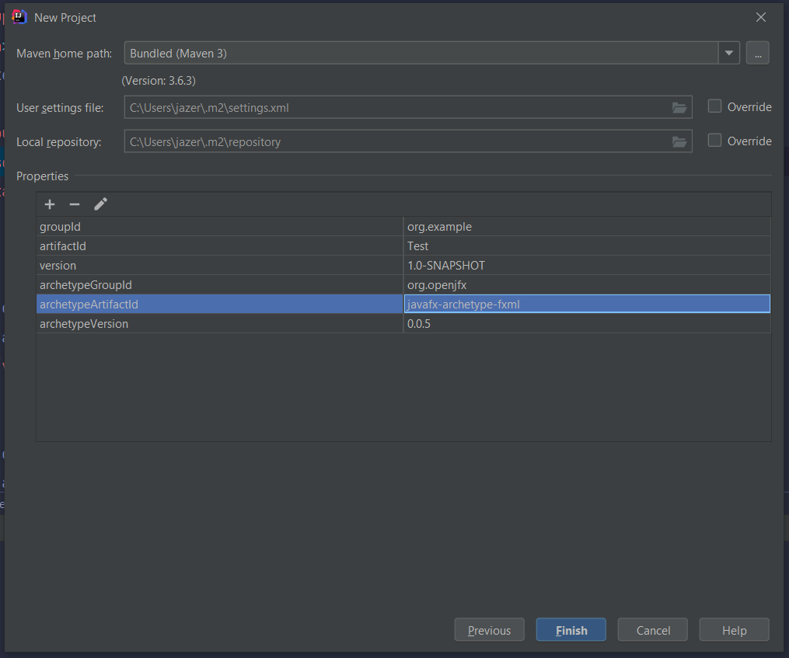
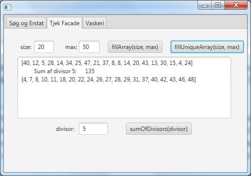
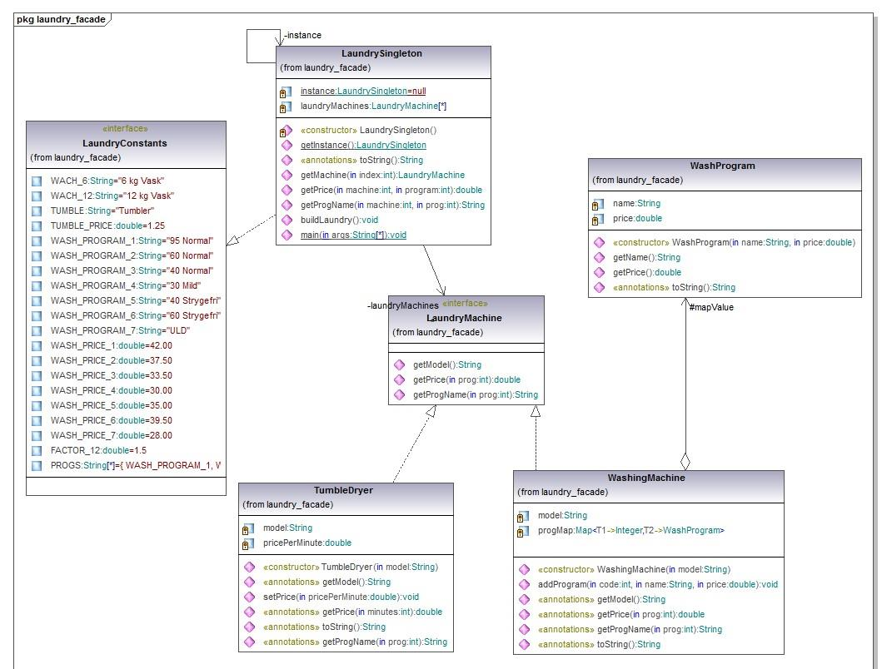
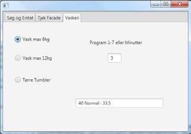
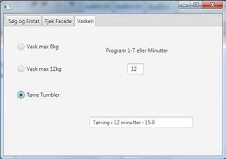
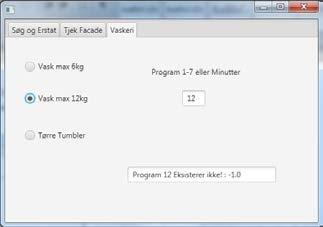

# Exercises for Lecture 12

## Task 1 - Opsætning af JavaFX

__Formål__: At oprette eksamensprojektet som en JavaFX applikation, navngivet korrekt og forberedt til de øvrige eksamensopgaver.

Flg. video guider jer igennem installationen af JavaFX i IntelliJ: [Setting up JavaFX with Maven in IntelliJ](https://www.youtube.com/watch?v=1xdmse3-mM4) __husk at bruge version 0.0.5 i jeres projekt og java-version 15__.

1. Opret et nyt projekt i IntellIJ. Vælg _Maven_ som projekt type og tjek "create from archetype".
   - Har du ikke har tilføjet JavaFX archetypen (er du usikker har du nok ___ikke___ gjort det :)) trykker du nu på "Add archetype".
      - I vinduet der popper op indtaster du nu
         - GroupId: **org.openjfx**
         - ArtifactId: **javafx-maven-archetypes**
         - Version: **0.0.5**
2. Dernæst vælger du den tilføjede "_org.openjfx:javafx-maven-archetypes_" archetype fra listen og trykker "Next".
3. Navngiv dit projekt og tryk "Next".
4. Du vil herefter blive mødt med flg. skærmbillede:
   
   Her skal du ændre "archetypeArtifactId" __værdien__ til "_javafx-archetype-fxml_". Tryk på "Finish". IntelliJ henter JavaFX ned og andre dependencies via maven. Dette kan godt tage nogle sekunder, så lav en kop kaffe i mellemtiden.
5. I det nye projekt slet _secondary.fxml_ filen i "src/main/resources/org/example" og _SecondaryController.java_ filen "src/main/java/org/example".
6. Start SceneBuilderen ved at dobbeltklikke på den dannede primary.fxml FXML-fil og slet den Button og Label som er dannet til eksemplet.
7. Det dannede Anchorpane kan med fordel gøres større, fx ved at sætte `Pref Width = 500` og `Pref Height = 325` under Layout, eller ved at trække i et af hjørnerne med musen. Sæt et `TabPane` på brugerfladen og tilpas dets størrelse til `Fit to Parent`
8. Pak den udleverede zip-fil _Lesson12Exercise.zip_ ud, og kopier de 2 mapper til projektets "src/main/java" mappe.

## Task 2 - Facade-mønsteret og lidt basic java
**Formål**: At implementere en Facade-klasse, som GUI-laget kan benytte.

1. Implementer en klasse `Facade.java` i pakken facade.
2. Tilføj en privat variabel `int[] intArray`;
3. Tilføj en privat variabel af typen `java.util.Random`.
4. Initialiser Random-generatoren i constructoren.
5. Tilføj en ”getter()”-metode, som returnerer `intArray;`

_I de følgende 3 delopgaver programmeres 3 algoritmer, som arbejder på et array og benytter loops og betingede saetninger._

### Task 2.1 - public int[] fillArray(int size,int max)

Metoden skal initialisere `intArray` til størrelsen `size` og udfylde det med tilfældige tal (_Random numbers_) i intervallet `[0..max]` og returnere arrayet.

### Task 2.2 - public int sumOfDivisors(int divisor)

Metoden skal returnere summen af de tal fra `intArray`, som `divisor` går op i (`x % divisor == 0`).

### Task 2.3 - public int[] fillUniqueArray(int size, int max)

Metoden skal initialisere `intArray` til størrelsen `size` og udfylde det med tilfældige tal i intervallet `[0..max]`, idet det sikres at `size < max` og at ingen tal gentages. 
   
_Hint: definer en privat metode `contains(int x, int beforeIndex)`, som tjekker
tallene fra random-generatoren, inden de saettes ind i arrayet._

Inden arrayet returneres kan det med fordel sorteres med `Arrays.sort()`, så det er nemmere at overskue om tallene er unikke.

Eksempel: Eksekvering af `main()`-metoden kan fx give: 
```
fillArray: [0, 4, 5, 5, 4, 5, 1, 5, 6, 2, 7, 5, 4, 2, 1, 8, 1, 4, 9, 8] Divisors of 3 has Sum: 15
fillUnique: [1, 2, 3, 4, 6, 7, 8, 9, 10, 13, 16, 17, 18, 20, 21, 23, 24, 26, 27, 28] size er større end max!
Error: null
```

### Task 2.4 - Kald af metoder fra GUI-laget

Navngiv 2. Tab ”_Tjek Facade_”.

Erklær Facaden som en variabel og initialiser den i `initialize()`-metoden.

Tilføj komponenter til Tjek-fanebladet, så de 3 metoder i Facaden kan testes fra en `actionHandler`, og resultaterne
vises. Fx som vist her:



## Task 3 - Polymorphism og en Facade der bruger Singleton-mønsteret

Dette klassediagram viser en forenklet struktur af et møntvaskeri:



Interfacet `LaundryMachine` repræsenterer alle de apparater, som kan benyttes i et vaskeri (vask, tørring, centrifugering, sæbe-automat, kaffeautomat mm.). I denne opgave er dog kun vaskemaskiner og
tørretumblere taget med:

`LaundryMachine.java` (udleveret kode) definerer disse metoder:

| Metode                            | Return                                       |
|-----------------------------------|----------------------------------------------|
| `String getModel()`               | Returnerer maskinens Model-betegnelse        |
| `double getPrice(int program)`    | Returnerer prisen for benyttelse af maskinen |
| `String getProgName(int program)` | Returnerer en beskrivelse af en benyttelse   |

`TumbleDryer.java` repræsenterer tørretumblere:

- implementerer interface `LaundryMachine`
- constructoren skal tage model-betegnelsen som parameter

| Metode                                 | Info                                                               |
|----------------------------------------|--------------------------------------------------------------------|
| `void setPrice(double pricePerMinute)` | Sætter minutprisen for brug af maskinen.                           |
| `double getPrice(int program)`         | Returnerer hvad det koster at benytte maskinen i program minutter. |
| `String getProgName(int program)`      | Returnerer fx "Tørring i 30 minutter", hvis prog =30.              |

`WashingMachine.java` repræsenterer vaskemaskiner:

- implementerer interface `LaundryMachine`
- constructoren skal tage model-betegnelsen som parameter
- Indeholder en variabel af typen `Map<Integer, WashProgram>`:
  _Indeholder de programmer der er til rådighed_.

| Metode                                                 | Info                                                                  |
|--------------------------------------------------------|-----------------------------------------------------------------------|
| `void addProgram(int prog, String name, double price)` | Definerer et vaskeprogram og lægger det i mappen med `prog` som nøgle |
| `double getPrice(int program)`                         | Returnerer hvad det koster at benytte programmet med koden `program`  |
| `String getProgName(int program)`                      | Returnerer navnet på programmet `prog`                                |

`WashProgram.java` (udleveret kode) repræsenterer ét vaskeprogram med et navn og en pris.

`LaundryConstants.java` (udleveret kode) er et interface, som definerer model-navne, program-navne, program-priser, samt et array af program-navne. Disse konstanter kan benyttes til oprettelse af et
testvaskeri, samt til brugerfladen i opgave 3.2

`LaundrySingleton.java` repræsenterer et testvaskeri, som dels kan afprøves via klassens `main()`-metode, dels kan fungere som _Facade_ i javaFX-GUI’en. Kun den del af koden, som gør den til en Singleton klasse, er ikke implementeret.

Den indeholder bl.a. metoden `public void buildLaundry()`, som bygger et vaskeri med værdierne
fra `LaundryConstants`.

### Task 3.1 - Singleton

__Formål__: At implementere en klasse, som overholder Singleton-mønsteret.

Tilføj kode til `LaundrySingleton.java`, så klassen bliver en Singleton-klasse. Dvs. at dens instance-metoder kun kan tilgås via metoden
`public static LaundrySingleton getInstance();`

### Task 3.2 - Implementationer af interfacet LaundryMachine

__Formål__: Implementering af polymorphiske metoder, defineret i et interface.

Implementér den manglende kode i disse filer:
- TumbleDryer.java
- WashingMachine.java

Ved eksekvering af `main()`-metoden i `LaundrySingleton` bør sidste del af udskriften ligne:
```
Vaskemaskine max 6 kg:
40 Strygefri        35,00

Vaskemaskine max 12 kg: 
40 Strygefri        52,50

Tørre Tumbler:
Tørring i 5 minutter 6,25
```

### Task 3.3 - GUI

__Formål__: Implementering af en simpel brugerflade, som benytter `LaundrySingleton`-klassen til kald af de polymorphiske metoder i `LaundryMachine`-interfacets implementationer.

Sæt en ny `Tab` på brugerfladen og kald den ”_Vaskeri_”.

Fra brugerfladen skal det vaere muligt at teste vaskeriet. For hver af de 3 maskiner, der genereres af `LaundrySingleton.buildLaundry()`, skal det være muligt at vælge et program (antal minutter på
tørretumbleren) og få oplyst prisen for det:

- Tilføj linjen `LaundrySingleton.getInstance().buildLaundry()`; til `initialize()`-metoden i `FXMLDocumentControlleren` så testvaskeriet er til rådighed.
- Lad testbrugerfladen bestå af:
  - Tre `RadioButton`s i en fælles `ToggleGroup`, til valg af vaskerimaskine.
  - En `Label` og et `TextField` til indtastning af programnummer eller tørretid.
  - Et `Textfield` til visning af programvalg og pris.
  - Når en vaskerimaskine vælges skal programnavn og pris findes via metoder i `LaundrySingleton`.

Her er tre eksempler (i det sidste eksempel benyttes værdien -1.0 som fejlkode for prisen på manglende program):


> Program 3 valgt på maskine nr. 0.


> 12 minutters tørring valgt på maskine nr. 2.


> Ikke-eksisterende program valgt på maskine nr. 1.