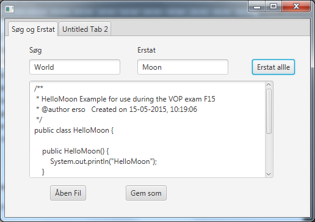

# Search & Replace
## Tasks

### Task 1 - Search and Replace

**Formål**: At benytte javaFx til udvikling af en GUI-applikation med søg-og erstat funktionalitet.

Opret flg. elementer på dit gui:

  - `Label` og `TextField` til den tekst der skal søges efter.
  - `Label` og `TextField` til den tekst der skal erstattes med,
  - `TextArea` til teksten der skal søges i.
  - `Button` til _Replace All_ funktionalitet

Programmér en `actionHandler` til knappen, så alle forekomster af søg-teksten i tekstarealet erstattes med erstat-teksten.

__Hint__:
  - For at tilgå filer i `resources` directory'et kan flg. benyttes:
    - Fra en statisk kontekst: `[KLASSENAVN].class.getClassLoader().getResource("filename").getFile()`
    - Fra en instans kontekst: `getClass().getClassLoader().getResource("DryLips.txt").getFile()`

### Task 2 - Simpel File-I/O

**Formål**: At indlæse teksten, der ønskes behandlet, fra en fil og gemme den ændrede tekst i en anden fil

  1. Implementer interfaced `javafx.fxml.Initializable` i `PrimaryController.java` og tilføj de påkrævede metoder.
  2. Erklær en instance-variabel af typen `javafx.stage.FileChooser`.
  3. Initialiser den i `initialize()`-metode og sæt `InitialDirectory` til at
     pege på projektmappen (`new File(".")`)
  4. Tilføj nu knapper til "Åben Fil" og "Gem som".
  5. `ActionHandler` på ”Åben Fil”-knappen skal benytte `FileChooser`'en, så den ønskede fil kan vælges og indholdet skrives i tekstarealet.
  6. `ActionHandler` på ”Gem som”-knappen skal benytte `FileChooser`'en til at vælge en eksisterende fil eller erklære en ny fil, hvori den ændrede tekst fra tekstarealet kan skrives.

I eksemplet er ”HelloWorld.txt” læst ind, alle forekomster af ”World” ændret til ”Moon” og resultatet gemt i
”HelloMoon.txt”.