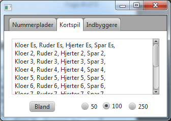
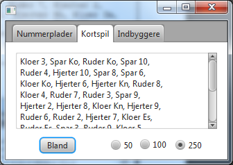

# Card Games

## Introduction

I denne opgave skal der implementeres et spil kort. Programmet består af tre klasser:

- `CardInterface.java` Et interface hvori der er erklæret `int`-konstanter for de fire kulører (suit på engelsk):
  - SPADES = 4 (Spar)
  - HEARTS = 3 (Hjerter)
  - DIAMONDS = 2 (Ruder)
  - CLUBS = 1 (Klør)
  - samt for værdierne ACE = 1 (Es), JACK =
  11 (Knægt), QUEEN = 12 (Dame) og KING = 13 (Konge), idet det antages at ACE altid er det mindste kort i en given
  farve.

  Desuden er der defineret `String`-konstanter, indeholdende danske betegnelser for de 4 kulører, billedkort og es.
  Disse kan med fordel benyttes til udskrift. Husk at konstanter blot er synonymer for værdier. Der er ikke erklæret
  metoder i interfacet.
- `Card.java` skal repræsenterer ét enkelt kort. En instance af Card har to `int`-felter, som definerer hhv. `face` (
  værdi) og
  `suit` (kulør).
- `DeckOfCards.java` repræsenterer de 52 kort, som et spil kort uden jokere består af.

## Tasks

### Task 1 - Klassen Card.java

Implementer en klassen `Card implements CardInterface`. De to felter `face` og `suit` skal tildeles værdier fra
parametre til constructor'en. Hvis ikke parametrene er lovlige (dvs. `face < ACE, face >
KING`, `suit < CLUBS eller suit > SPADES`), skal der udskrives en fejlmeddelelse.

### Task 2 - Udskrivning af et kort

Implementer `public String toString()`, så der returneres en tekst med kortes `suit` og `face`. Til test kan
følgende `main()`-metode implementeres i `Card.java`.

```java
public static void main(String[]args){
        System.out.println(new Card(1,3));
        System.out.println(new Card(3,1));
        System.out.println(new Card(13,4));
        System.out.println(new Card(12,3));
        System.out.println(new Card(17,5));
        }
```

Ønsket output ses i boksen:

```
Hjerter-Es
Kloer-3
Spar-Ko
Hjerter-Da
Ulovligt kort: 5 17
```

### Task 3 - 52 spillekort

`DeckOfCards.java` implementerer også `CardInterface`, så konstantværdierne kendes. Der er erklæret et int-array,
en `main()`-metode til test, samt en `toString()`-metode, som udskriver Cardarrayet med 4 kort pr linje.

I constructor'en skal int-arrayet initialiseres til størrelsen `NUMBER_OF_CARDS` og der skal dannes instanser af de 52
mulige kort, som skal indeholdes i arrayet. Benyt nogle af konstanterne fra interfacet til at styre de løkker der
udfylder arrayet.

### Task 4 - Blande kort

Implementer `public void shuffle(int swaps)`, så kortene kan blandes. Parameteren `swaps`
angiver hvor mange gange to kort i bunken skal byttes om.

_Hint_: Benyt en instance af `java.util.Random` til at vælge to pladser i arrayet, og byt kortene om. Dette gøres swaps
gange.

Herunder ses et output, som det kan se ud efter task 3 og 4 er løst:

```
Task 3:
Kloer Es, Ruder Es, Hjerter Es, Spar Es,
Kloer 2, Ruder 2, Hjerter 2, Spar 2,
Kloer 3, Ruder 3, Hjerter 3, Spar 3,
Kloer 4, Ruder 4, Hjerter 4, Spar 4,
Kloer 5, Ruder 5, Hjerter 5, Spar 5,
Kloer 6, Ruder 6, Hjerter 6, Spar 6,
Kloer 7, Ruder 7, Hjerter 7, Spar 7,
Kloer 8, Ruder 8, Hjerter 8, Spar 8,
Kloer 9, Ruder 9, Hjerter 9, Spar 9,
Kloer 10, Ruder 10, Hjerter 10, Spar 10,
Kloer Kn, Ruder Kn, Hjerter Kn, Spar Kn,
Kloer Da, Ruder Da, Hjerter Da, Spar Da,
Kloer Ko, Ruder Ko, Hjerter Ko, Spar Ko
```

```
Task 4:
Hjerter 8, Ruder Da, Kloer 9, Hjerter 10,
Hjerter 3, Hjerter 7, Ruder 6, Spar Da,
Ruder 10, Spar Es, Hjerter Da, Hjerter 5,
Kloer 3, Kloer Es, Hjerter Ko, Hjerter 9,
Spar 4, Spar 7, Spar 9, Kloer 7,
Spar Kn, Ruder Ko, Hjerter 6, Kloer 5,
Ruder Es, Kloer 6, Spar 6, Hjerter Es,
Spar 3, Ruder 9, Spar Ko, Ruder 5,
Ruder 8, Spar 5, Ruder 7, Hjerter 2,
Kloer Kn, Spar 2, Hjerter Kn, Kloer Da,
Spar 8, Kloer 2, Kloer 4, Spar 10,
Ruder Kn, Hjerter 4, Kloer Ko, Kloer 8,
Kloer 10, Ruder 4, Ruder 2, Ruder 3 
```

### Task 5 - Integration med UI

Design brugerfladen så udseende og funktionalitet ligner dette (**fanerne kan ignoreres**):



- En instance af `DeckOfCards` skal erklæres i
  `PrimaryController.java` og initialiseres i
  `initialize()`-metoden. Resultatet skal skrives i tekstarealet.
- Ved klik på _Bland_-knappen, skal kortene blandes ved kald af shuffle()-metoden, hvor antallet af ombytninger (_swaps_)
  bestemmes af hvilken af de 3 _RadioButtons_ der er valgt.

