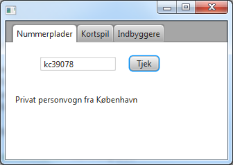

# License Plates

## Introduction

Historie: I perioden fra 1958 til 1966-68 (hvor registreringen af motorkøretøjer gradvis overgik til Centralregisteret
for Motorkøretøjer), kunne man på en nummerplades 2 kendingsbogstaver se hvilken politikreds et køretøj var
indregistreret i, og på det 5-cifrede nummer hvilken anvendelse køretøjet havde.

Denne opgave går ud på at finde disse oplysninger ud fra en given nummerplade.

## Tasks

### Task 1 - Indlæsning af politikredse

Filen `NumberPlates.java` indeholder konstanten `public static final int LENGTH = 7;` og
referencen `private Map<String, String> districtMap;`

Desuden er der defineret et array af `VehicleType`, som kan benyttes til at bestemme anvendelsen af et køretøj med en
given nummerplade. Objekterne i arrayet repræsenterer disse regler (meget forenklede):

| Range           | Type                    |
|-----------------|-------------------------|
| 10,000 - 19,999 | Motorcykel              |
| 20,000 - 45,999 | Privat personvogn       |
| 46,000 - 46,999 | Udlejningsvogn          |
| 47,000 - 48,999 | Hyrevogn                |
| 49,000 - 49,899 | Skolevogn               |
| 49,900 - 49,999 | Ambulance el. lign.     |
| 50,000 - 84,999 | Diverse andre køretøjer |

I constructor'en skal `districtMap` initialiseres, så opslag kan foretages hurtigst muligt, og metoden `readFile()`
kaldes.

Implementer `private void readFile()`, så _nummerplader.txt_ indlæses linje for linje og indsættes i
`districtMap` med kendingsbogstaver som `key` og politikreds som `value`.

### Task 2 - Validering af nummerplader

Implementer metoden `public String validate(String plate)`, så der returneres en `String` indeholdende køretøjets
anvendelse og politikreds. Fx bør `KC39078` give resultatet ”_Privat personvogn fra København_”.

_Hints_:

- Tjek først om længden af parameteren `plate` er nøjagtig 7 karakterer. Returner en fejlmeddelelse hvis ikke.
- Benyt metoden `private String validateDistrict(String districtCode)` til tjek politikreds, ved opslag i `districtMap`.
  Returner fx ”_Kreds findes ikke_” hvis ikke kendingsbogstaverne findes i mappen. Det skal være ligegyldigt om
  kendingsbogstaverne er skrevet med store eller små bogstaver.
- Benyt metoden `private String validateVehicleType(int number)` til tjek af anvendelse: Konverter de sidste 5
  karakterer i `plate` til en int og benyt denne til parameteren
  `number`. Iterer gennem arrayet med `VehicleType` og kald `isA()`-metoden. Hvis typen findes,
  returneres `getVehicleType()`. Ellers fx ”_Illegalt nummer: xxxxx_”

Funktionaliteten kan tjekkes ved at eksekvere `main()`-metoden i `NumberPlates.java` . Følgende output er forventet:

```
KC39078: Privat personvogn fra København
kc49900: Ambulance el. lign. fra København
KO47078: Hyrevogn fra Kreds findes ikke
EN19022: Motorcykel fra Korsør
EN90022: Illegalt nummer: 90022 fra Korsør
EN190220: Illegal length!
```

### Task 3 - Brugerflade til Tjek af nummerplader

I SceneBuilderen tilføjes følgende komponenter (ignorer fanerne):

- En _TextField_ til indtastning af en nummerplade.
- En _Button_ med teksten ”Tjek”.
- Et _Label_ til at skrive resultatet på.
- Giv alle tre komponenter et variabelnavn, så de kendes i `PrimaryController.java`
- Tilføj en _On Action_-handler til Tjek-knappen



I `PrimaryController.java`:

- Erklær en privat variabel af typen `NumberPlates`.
- Implementer klassen `PrimaryController implements Initializable`.
- Initialiser variablen i `initialize()`-metoden.
- Tilføj kode til _On Action_–handleren, så et klik på _Tjek_ medfører at et bud på en nummerplade, skrevet i
  tekstfeltet, valideres og resultatet skrives på Labelen.