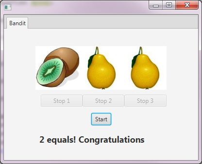

# Én Armet Tyveknægt

# Tasks

Udtrykket ”én-armet tyveknægt” (på engelsk ’Slot’ eller ’One-armed bandit’) er slang for de gammeldags spilleautomater, hvor man kunne stå i timevis og proppe penge i med den ene hånd og rykke i et håndtag med den anden. I
denne opgave skal der implementeres en sådan bandit, dog uden indsats- og gevinst-delen. Et muligt layout ses her under:



Systemet består af:
- 3 felter (`ImageView`) til skiftende sekvenser af billeder.
- 3 knapper, så sekvenserne kan stoppes individuelt.
- 1 startknap, som starter sekvenserne i alle 3 felter.
- 1 label, som viser resultatet efter at alle 3 sekvenser er slut

**Det nemmeste valg ville være at benytte en implementation af javafx.animation.AnimationTimer, men det er
<span style="color:red">FORBUDT</span> i denne opgave, da det er Threads i forbindelse med javaFx, vi træner.**

Resource filer: indeholder 10 billeder af frugt. Billederne er 90*90 pixel.

## Task 1
Definer brugerfladen i SceneBuilder’en.
Indlæs de udleverede billeder i et fælles `javafx.scene.image.Image[]`, som udfyldes i `initialize()`-metoden. Hvert billede kan indsættes i arrayet med `new Image(getClass().getResource(filename).toURI().toString());`

## Task 2
Benyt en tæller-variabel til at holde øje med hvor mange sekvenser, der kører. Tilgang til variablen skal
synkroniseres.

`ActionHandler` på Start-knappen:
- Starter skiftningen af billeder på de 3 ImageViews i hver sin Thread.
- Der skal indlægges forskellige ventetider i de tre Threads imellem hvert skift af billeder. Fx 120, 100 og
140 millisekunder (det er for en gang skyld tilladt at bruge magic numbers).
- Start knappen disables.
- Stop knapperne enables.
- Tælleren nul-stilles.
- Teksten nederst ændres til fx ”Running..”

`ActionHandler` på Stop-knapperne:
- Hver knap stopper én sekvens (fx med et interrupt af den tilhørende Thread).
- Knappen disables.
- Tælleren justeres

Når alle 3 Threads er stoppet:
- Start-knappen enables
- Resultatet skrives nederst. Fx: ”3 ens: Jackpot”, ”2 ens: Du vinder lidt” og ”TABER!!!”

___Hint___: _Lav en indre klasse til at udføre animationerne. Brug fx dette kodeskelet_:

```java
public class BanditRunnable implements Runnable {
    
    private int i; //Index of current picture
    private long sleepTime;
    private boolean running;
    private ImageView iw;
    
    public BanditRunnable(int i, long sleepTime, ImageView iw)   {
        this.i = i;
        this.sleepTime = sleepTime;
        this.iw = iw;
    }
    
    @Override
    public void run() {
        // Code the animation here....
    }
 }
```