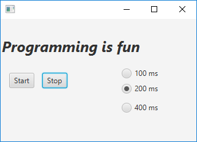

# Word Counter

## Task 1

Start by repeating the basics we learned during lesson 5 by doing this exercise (__Big Java ch20 multithreading.pdf__)

P __20.7__ Write a program WordCount that counts the words in one or more files.

Start a new Thread for each file. You can use "alice30.txt", "boscombe.txt", and "snow-white.txt" for testing.

The result should be something like:

```
snow-white.txt: 1293
boscombe.txt: 9674
alice30.txt: 26467
```

## Task 2

Study the methods on the Thread class in Liang chapter 32.4. Pay attention to the Check Point questions on page 32.8.

**NB**: _The treatment of the Thread methods in Liang is very short, so you should study part 20.2 in _Big Java_, to
expand your knowledge of how to interrupt a Thread. Especially Programming Tip 20.2 on page W893._

## Task 3 - Flashing Text

Expand the program, so the UI looks like this:



- Start: Starts the animation thread
- Stop: Stop the animation by interrupt()
- RadioButtons: Change the sleep-time. Shall work even when the animation is running.

Please note: Line 19 in the Controller class: `thread.setDaemon(true);` If the Thread is not set to be a Deamon, the
thread will continue running after the program is closed

## Task 4

Read Liang 32.6 to achieve knowledge of using _Threadpools_.

## Task 5

Study Liang 32.7 about Synchronization. Experiment with the example Listing 32.4 and try out the suggestions in 32.8.